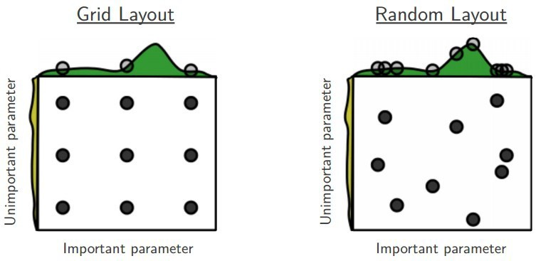

% Tuning degli iperparametri in Tensorflow/Keras
% Marco Fiume
% 22/7/2022

Gli iperparametri definiscono la struttura di una rete neurale e il modo in cui essa viene addestrata. Alcuni esempi sono: l’algoritmo di ottimizzazione, il learning rate, il numero di livelli nascosti, il numero di unità per ogni livello, l’utilizzo di tecniche di regolarizzazione come il dropout ecc. Le possibili combinazioni sono infinite e le prestazioni finali dipendono fortemente da una scelta corretta degli iperparametri. Con l’aumentare della complessità dei modelli è diventato necessario automatizzare questa ricerca. Nel caso in esame è stato studiato l’algoritmo di ottimizzazione Hyperband.

## 1. Introduzione
La ricerca dei migliori iperparametri è soggetta a un fenomeno noto come *curse of dimensionality*, vale a dire che le possibili combinazioni di parametri crescono esponenzialmente con il numero degli stessi. Al contrario di quanto avviene per l’apprendimento dei parametri interni al modello, non è possibile calcolare un gradiente che consenta di minimizzare iterativamente l’errore su un set di validazione. Di conseguenza bisogna fare dei tentativi alla cieca all’interno dello spazio di ricerca, addestrando il modello molte volte, ma tutto ciò è computazionalmente costoso e richiede molto tempo.

Il problema può essere in parte mitigato limitandosi a considerare variazioni di modelli che in passato hanno ottenuto buoni risultati su problemi affini a quello che si intende risolvere. A partire dalla tipologia di rete neurale: ANN, CNN, RNN ecc. Oppure lavorare in maniera incrementale a partire da modelli pre addestrati. Resta comunque necessario sviluppare sistemi automatizzati per il tuning degli iperparametri.

Di seguito verrà preso in esame un piccolo sottoinsieme dei metodi possibili.

### 1.1 Grid search
L’approccio più semplice consiste nel definire un elenco di valori possibili per ogni iperparametro, costruendo così una griglia di ricerca data da tutte le combinazioni possibili. In seguito il modello viene addestrato sull’intera griglia selezionando la configurazione che ottiene il risultato migliore sull’insieme di validazione o tramite cross-validazione.

Questo metodo è molto dispendioso e spesso non è praticabile per quanto detto in precedenza.

### 1.2 Random search
In questo caso, per ogni iterazione, il modello è addestrato su una configurazione ottenuta estraendo casualmente  ogni iperparametro all’interno dello spazio di ricerca. Questo comporta due vantaggi:

- la possibilità di controllare il numero di iterazioni in base al budget di tempo o risorse di calcolo;
- i parametri possono assumere qualunque valore, all’interno degli intervalli predefiniti, anziché un insieme discreto di valori. Questo è evidenziato nella figura.

### 1.3 Successive halving
Nei metodi precedenti è necessario addestrare completamente il modello a ogni iterazione, ma si rischia di sprecare risorse su configurazioni che fin da subito ottengono bassi risultati. per ovviare a questo problema è stato sviluppato il seguente approccio:

- Per prima cosa tutti i modelli candidati vengono addestrati con una quantità limitata di risorse. Per esempio utilizzando solo un sottoinsieme dei dati di training o un piccolo numero di epoche di addestramento. Nel caso lo spazio di ricerca degli iperparametri sia troppo  esteso, si seleziona un campione casuale di n modelli;

- si elimina metà dei modelli, in modo da conservare quelli che hanno ottenuto il punteggio migliore sui dati di validazione;

- l’addestramento dei modelli superstiti continua utilizzando il doppio delle risorse utilizzate nell’iterazione precedente. Per esempio aggiungendo altre epoche di addestramento.

Il processo si ripete finché non ne è rimasto soltanto uno. A questo punto il modello selezionato può essere addestrato completamente.

Questo algoritmo risolve il problema menzionato in precedenza, ma ne introduce uno nuovo. Una volta stabilito il budget totale B, è necessario definire il numero di campioni n, di conseguenza B/n saranno le risorse allocate per ognuno di essi durante la prima iterazione. Bisogna cercare un compromesso tra selezionare pochi campioni e avere un B/n alto o avere n alto e dedicare poche risorse per ognuno di essi. Entrambe queste strategie possono fallire per i seguenti motivi:

- se n è grande il rischio è di eliminare immediatamente dopo una sola iterazione modelli buoni, ma lenti a convergere verso un risultato ottimale;

- se n è basso, quindi B/n è alto, si stanno testando meno candidati nello spazio di ricerca, potenzialmente lasciando fuori combinazioni migliori. Inoltre si rischia di allocare subito molte risorse su modelli scadenti.

Un buon algoritmo di tuning degli iperparametri non dovrebbe a sua volta avere dei parametri tra cui scegliere, se non la quantità di risorse complessive da utilizzare. Un evoluzione di questo approccio che tenta di eliminare questo problema è l’algoritmo Hyperband.

### 1.4 Hyperband
La soluzione proposta in questo articolo [(link)](https://jmlr.org/papers/v18/16-558.html) consiste nell’iterare il successive halving con diversi valori di B/n. In altre parole, una volta fissato il budget a disposizione, si aggiunge un ciclo esterno che ripete il processo per diversi valori di n. In questo modo si dovrebbero evitare le criticità legate alla scelta a priori del giusto compromesso tra B ed n, al prezzo di una maggiore complessità.

## 2. Caso di studio - classificazione di fake news
Il caso preso in esame riguarda la classificazione supervisionata di fake news. Il dataset utilizzato è [WELFake](https://www.kaggle.com/datasets/saurabhshahane/fake-news-classification) dal sito [www.kaggle.com](http://www.kaggle.com/), esso consiste di 72.123 articoli di cui 35.028 reali e 37.106 notizie false. Per ogni riga sono presenti 2 feature: il titolo e il testo dell’articolo.

Il modello scelto per la classificazione è stata una rete neurale completante connessa implementata in tensorflow. Per l’ottimizzazione degli iperparametri è stata utilizzata la libreria python keras_tuner che fornisce un'implementazione di Hyperband.

### 2.1 Preparazione dei dati
   - In alcuni casi mancava o il titolo o il testo dell’articolo. I dati mancanti sono stati riempiti utilizzando una stringa di testo vuota;
- sono stati concatenati titolo e testo degli articoli separandoli con uno spazio. In questo modo si è ottenuta una singola feature;
- le colonne contenenti l’id, il titolo e il testo sono state rimosse;
- il dataframe così ottenuto è stato suddiviso in training e test set riservando il 20% dei dati per il test;

### 2.1 Modello di base
Per avere un punto di riferimento è stato utilizzato il modello schematizzato nella figura 1. Sono state scelte le funzioni relu e softmax rispettivamente per strato nascosto e uscita. Utilizzando un batch size di 64 e l’early stopping con min_delta di 0.01 e 20% dei dati come set di validazione, dopo 6 epoche di addestramento, si ottiengono valori di precisione e richiamo pari a 0.80.

{ width=50%}

### 2.3 Spazio degli iperparametri
Di seguito sono elencati gli iperparametri selezionati per l'ottimizzazione e il relativo intervallo di valori valori:

| Parametro | tipo | Valori | step |
| :--- | :--- | :--- | :--- |
| N di strati | intero | [1,3] | 1 |
| Unità per strato | intero | [10, 100] | 10 |
| Dropout 0.5 | boleano | vero, falso ||

In questo caso è stato utilizzato un vocabolario con max_tokens pari a 3000 per permettere al modello di catturare più informazioni.

### 2.4 Risultati
Nella figura è rappresentato il modello finale ottenuto con il miglior insieme di iperparametri. Questo è stato addestrato utilizzando le stesse impostazione del modello di base ottenendo valori di precisione e richiamo pari al 98%.

{ width=50% }

## 3. Conclusioni
Il caso preso in esame, per quanto semplice, ha permesso di ottenere una dimostrazione dell'applicazione di un algoritmo di tuning degli iperparametri in Tensorflow/Keras. Hyperband è solo uno degli approcci possibili per migliorare le performance della semplice ricerca a griglia, in un campo in continua evoluzione.