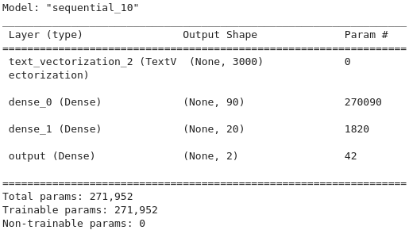

% Tuning degli iperparametri in Tensorflow/Keras
% Marco Fiume
% 16/11/2022

---
classoption:
- aspectratio=169
---

# Indice
- Caso di studio: classificazione di fake news
- Esplorazione dati
- Preparazione dati
- Modello di base
- Hyperband
- Ottimizzazione iperparametri
- Modello finale

# Classificazione di fake news
Il caso preso in esame riguarda la classificazione supervisionata di fake news. Il dataset utilizzato è [WELFake](https://www.kaggle.com/datasets/saurabhshahane/fake-news-classification) dal sito www.kaggle.com, esso consiste di 72.123 articoli di cui 35.028 reali e 37.106 notizie false. Per ogni riga sono presenti 2 feature: il titolo e il testo dell’articolo.

L'obiettivo è addestrare un modello in grado di distinguere tra notizie vere o false.

# Esplorazione dei dati
Struttura del dataframe pandas:

::: columns

:::: column

| Colonne | Non Nulli | Dtype |
| :---- | :---- | :---- |
| Unnamed:0 | 72134 | int64 |
| title | 71576 | object |
| text | 72095 | object |
| label | 72134 | int64 |

::::

:::: column

- Unnamed:0 è un id progressivo;
- label può assumere i valori 0 = fake news e 1 = notizia reale;
- sono presenti dati mancanti nelle colonne title e text.

::::

:::

# Preparazione dei dati
- I dati mancanti sono stati riempiti utilizzando una stringa di testo vuota;
- sono stati concatenati titolo e testo degli articoli separandoli con uno spazio;
- le colonne contenenti l’id, il titolo e il testo sono state rimosse;
- il dataframe così ottenuto è stato suddiviso in training e test set riservando il 20% dei dati per il test;

# Modello di base - rete neurale in Tensorflow/Keras
::: columns
:::: column
{ width=100% }
::::
:::: column
- vettorizzazione input;
- livello nascosto con 20 unità con funzione di attivazione Relu ;
- uscita con funzione di attivazione softmax;
- algoritmo di ottimizzazione: adam;
- early stopping;
- validation_split: 0.2
::::
:::
# Modello di base - prestazioni

|| precision | recall | f1-score | support |
| :---- | :---- | :---- | :---- | :---- | 
| 0 | 0.81 | 0.77 | 0.79 | 7089 |
| 1 | 0.79 | 0.83 | 0.81 | 7338 |
||||||
| accuracy ||| 0.80 | 14227 |
| macro avg | 0.80 | 0.80 | 0.80 | 14227 |
| weighted avg  | 0.80 | 0.80 | 0.80 | 14227 |

# Hyperband
L'algoritmo hyperband descritto in questo articolo [(link)](https://jmlr.org/papers/v18/16-558.html) rappresenta un estensione del successive halving.

## Successive halving
- Tutti i modelli candidati sono addestrati per un numero limitato di epoche. Nel caso in cui lo spazio ricerca sia troppo ampio viene selezionato un campione casuale di candidati come nel random grid search;
- si elimina metà dei modelli, in modo da conservare quelli che hanno ottenuto il punteggio migliore sui dati di validazione;
- nel round successivo l'addestramento dei modelli superstiti prosegue per un numero doppio di epoche;
- il processo si ripete finchè non è rimasto un solo modello.

# Hyperband

## Limiti di questo approccio
Nel punto 1, nel caso in cui lo spazio di ricerca sia troppo ampio è necessario selezionare n modelli. Considerando il budget totale di risorse a disposizione B, ogni modello potrà essere addestrato per B/n epoche.

- se n è grande il rischio è di eliminare immediatamente dopo una sola iterazione modelli buoni, ma lenti a convergere verso un risultato ottimale;

- se n è basso, quindi B/n è alto, si stanno testando meno candidati nello spazio di ricerca, potenzialmente lasciando fuori combinazioni migliori. Inoltre si rischia di allocare subito molte risorse su modelli scadenti.

# Hyperband
Per ovviare a questi problemi Hyperband consiste nell'iterare succcessive halving per diversi valori di n:

- in ogni iterazione del ciclo esterno, denominata bracket, viene selezionato un valore n;

- per ogni B/n viene eseguito il successive halving.

# Ottimizzazione iperparametri
::: columns
:::: column
{ width=100% }
::::
:::: column
- vettorizzazione input;
- da 1 a 3 livelli nascosti;
- da 10 a 100 unità per ogni livello;
- dropout 0.5 o 0;
- stessi parametri di addestramento del modello di base;
- "factor" è il fattore di riduzione dei candidati per ogni bracket;
- "max_epochs" stabilisce il massimo budget a dispozione per l'addestramento di un modello.
::::
:::
# Modello finale
::: columns
:::: column
{ width=100% }
::::
:::: column
- 2 livelli nascosti;
- primo livello 90 unità;
- secondo livello 20 unità;
- nessun dropout
::::
:::
# Modello finale - prestazioni
|| precision | recall | f1-score | support |
| :---- | :---- | :---- | :---- | :---- | 
| 0 | 0.98 | 0.98 | 0.98 | 7089 |
| 1 | 0.98 | 0.98 | 0.98 | 7338 |
||||||
| accuracy ||| 0.98 | 14227 |
| macro avg | 0.98 | 0.98 | 0.98 | 14227 |
| weighted avg  | 0.98 | 0.98 | 0.98 | 14227 |